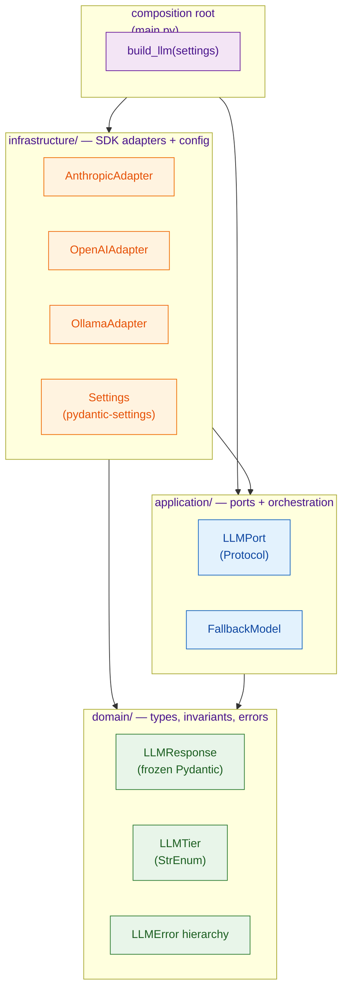
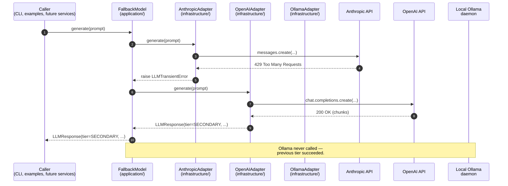

# Architecture

`claude-tool-choice-modes` is a hexagonal / DDD-lite Python application. Three layers,
one strict dependency rule, one composition root. The template exists to be
extended — most downstream projects will add more ports and more adapters
without ever needing to change the shape of this document.

This file is the map. [`SPECIFICATION.md`](SPECIFICATION.md) is the contract,
[`docs/DECISIONS.md`](docs/DECISIONS.md) is the ADR log. Read those for the
*why*; this file explains the *shape*.

## The dependency rule

Read the arrows as "knows about". `domain/` knows about nothing — it is the
stable core. `application/` knows about `domain/` so it can type its ports
and raise the right errors. `infrastructure/` knows about both so it can
implement ports and return domain types. `main.py` knows about all three
because *something* has to wire the graph, and centralising that wiring in
one place keeps the rest of the codebase testable in isolation.

The rule is enforced two ways. Imports at the top of every source file are
the first line of defence — pre-commit's `ruff` pass would flag an illegal
cross-layer import, and code review catches anything ruff misses. The second
line of defence is the test layout: `tests/unit/domain/` has no
`from claude_tool_choice_modes.infrastructure` line in it, and never should.

## What lives in each layer

### `domain/` — types, invariants, errors

Pure Python. Pydantic is the only third-party import allowed here, and only
because the domain types *are* Pydantic models. No HTTP clients, no SDKs, no
filesystem, no threads, no environment reads.

| Module | Purpose |
| --- | --- |
| `domain/llm.py` | `LLMTier` (StrEnum: `PRIMARY`, `SECONDARY`, `TERTIARY`), `LLMResponse` (frozen, `extra="forbid"`, validated invariants on text / tokens / timestamp). |
| `domain/errors.py` | `LLMError` → {`LLMTransientError`, `LLMPermanentError`, `LLMContentError`}. The only exception types that may cross a port boundary. |

If a future project needs to persist completions, for example, it adds a
`CompletionRecord` domain value object here. Not an ORM model, not a
dataclass that happens to be in the repo — a typed, validated piece of the
ubiquitous language.

### `application/` — ports + orchestration

Depends on `domain/` only. This layer owns the contracts the outside world
must satisfy, plus the composable pieces that operate purely against those
contracts.

| Module | Purpose |
| --- | --- |
| `application/ports.py` | `LLMPort` — `@runtime_checkable typing.Protocol` with `tier`, `model_name`, and a synchronous `generate(prompt, *, max_tokens, temperature) -> LLMResponse`. Plus `ConfigPort` and `LoggerPort` stubs for future growth. |
| `application/fallback.py` | `FallbackModel` — itself an `LLMPort`. Given an ordered list of `LLMPort` instances, it forwards `generate()` to the first tier; advances past `LLMTransientError`; re-raises `LLMPermanentError` / `LLMContentError` immediately because the next tier won't help. |

The key move is that `FallbackModel` is an `LLMPort`. Nothing downstream
needs to know whether it is talking to one adapter or a composed stack. Two
adapters chained in a fallback behave exactly like one adapter — same
protocol, same exception hierarchy, same return type. That compositionality
is what keeps the template extensible without leaking wiring concerns into
business code.

### `infrastructure/` — SDK adapters + config

Depends on `domain/` and `application/`. This is the only layer that imports
vendor SDKs or reads the environment. Every adapter:

- Implements `LLMPort`.
- Accepts its credentials + knobs as constructor arguments (no environment
  reads — that's `Settings`' job).
- Translates SDK-specific exceptions into one of the three domain error
  classes per ADR D3. Nothing like `anthropic.APIStatusError` leaks upward.

| Module | Purpose |
| --- | --- |
| `infrastructure/anthropic_adapter.py` | `AnthropicAdapter` — wraps the `anthropic` SDK (≥0.96). Tier: `PRIMARY`. Default model: `claude-haiku-4-5-20251001`. |
| `infrastructure/openai_adapter.py` | `OpenAIAdapter` — wraps the `openai` SDK (≥2.32). Tier: `SECONDARY`. Default model: `gpt-4o-mini`. |
| `infrastructure/ollama_adapter.py` | `OllamaAdapter` — wraps the `ollama` SDK. Tier: `TERTIARY`. Default model: `llama3.2:3b`. |
| `infrastructure/settings.py` | `Settings` — `pydantic-settings` loader for `.env`. Wraps API keys in `SecretStr`; coerces empty strings to `None` so an env-file placeholder doesn't become a zero-length API key. |

## The composition root (`main.py`)

`build_llm(settings)` is the single function allowed to import from all three
layers. It reads `settings.llm_tier` and returns one of two things:

- A single adapter (`primary` / `secondary` / `tertiary`). No fail-over.
  Missing credentials for the selected tier raise `LLMPermanentError` at
  construction — fail-fast per ADR D4.
- A `FallbackModel` (`fallback`). Every tier whose preconditions are met is
  included: cloud tiers only if their API key is set; Ollama is always
  appended because it has no credentials to gate on. A partial environment
  (only an Anthropic key, say) still yields a working two-tier fallback.

That's the whole composition story. Every other module takes an `LLMPort`
on its constructor and doesn't care whether it's a raw adapter or a stack.

## How data flows on a `generate()` call

`FallbackModel` walks the list in order, and the first tier that produces an
`LLMResponse` wins. A `LLMPermanentError` or `LLMContentError` from any tier
aborts the walk — those states do not improve by retrying elsewhere.

## Testing strategy

Three concentric suites, each with a different budget and a different failure
signal:

- **Unit tests** (`tests/unit/`, ~187 tests). Every source module has a
  dedicated file. Adapters monkey-patch the vendor SDK client so no network
  is touched; 100 % line coverage is a hard target on `src/`.
- **Contract tests** (`tests/contract/`, 32 parametrized cases). One test
  body × four adapter implementations (three real + one in-memory fake)
  proves that every `LLMPort` honours the same behavioural contract.
  Vendor-tagged failures (`test_returns_response[anthropic]`) mean the
  offending adapter drifted — not the contract.
- **Integration tests** (`tests/integration/`, empty at `v0.1.0`). Reserved
  for docker-compose-backed exercises. `make integration` is plumbed now so
  the surface is consistent; the first real test drops in without further
  wiring.

The contract suite is the architectural drift detector. A change to
`LLMResponse` invariants, a new adapter that swallows an error type, a
`FallbackModel` regression that forgets to re-raise `LLMPermanentError` —
each shows up as a specific, named contract failure rather than as a subtle
shape mismatch at runtime.

## Extension points

Adding a tier (e.g. Google Gemini):

1. Create `infrastructure/gemini_adapter.py` that implements `LLMPort` and
   maps SDK errors onto the three domain error classes.
2. Add a unit test file in `tests/unit/infrastructure/` that monkey-patches
   the SDK client and exercises each error branch.
3. Register the adapter with `tests/contract/conftest.py::LLM_ADAPTERS` —
   one `AdapterSpec` with `build` + three `inject_*` helpers. The 8
   contract tests pick it up automatically.
4. Wire it into `main.build_llm` if you want it reachable via `LLM_TIER`.

Adding an unrelated port (e.g. a `VectorStorePort` for RAG):

1. Define the protocol in `application/ports.py` (or a sibling file if
   the file grows large).
2. Add the domain types it depends on to `domain/`.
3. Ship one or more adapters in `infrastructure/`.
4. Compose them into `main.py` alongside the existing LLM wiring.

Either expansion stays inside the dependency rule and doesn't touch the
parts of the codebase that already work.

## What this template deliberately does **not** ship

Captured here for the same reason negative space is worth naming in any
architecture doc: future contributors should not ask "why didn't you do X"
and get silence. See SPECIFICATION.md §10 for the full list; the headline
omissions:

- **Async / streaming LLM calls.** `generate()` is sync for `v0.1.0`. A
  `stream()` sibling is planned for `v0.2` without breaking `generate()`.
- **Tool use / function calling.** Lands with the multi-agent F5 project.
- **Vector stores, retrieval, RAG.** Lands with F2.
- **Evaluation harness.** Lands with F7.
- **Cloud deploy / CD pipeline.** Per-project, not template-level.

The template's job is to give you a shaped starting point. Each of the above
is an honest addition you will make *in* a forked project, not something the
template should prejudge for you.
